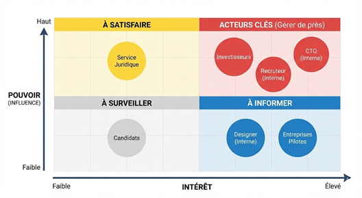
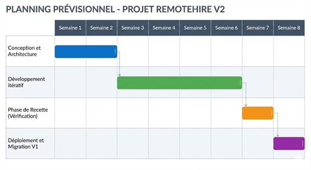

# RemoteHire V2 - Refonte Plateforme de Recrutement

> **Cahier des Charges Fonctionnel & Technique pour la refonte industrielle d'une plateforme de recrutement.**

## 📄 À propos du projet

**RemoteHire** est une startup spécialisée dans le recrutement tech international. Suite au succès de son MVP (V1), l'entreprise doit faire face à des limites techniques critiques (pertes de données, processus manuels).

Ce projet couvre l'intégralité de la phase de **Cadrage et Pilotage** pour la transition vers la **V2**.

**Objectifs clés :**
* 🚀 **Industrialisation :** Automatisation des imports (CSV) et gestion multi-offres.
* 💰 **Monétisation :** Intégration d'un système de paiement et passage au modèle SaaS.
* 🔒 **Fiabilité :** Sécurisation des données (RGPD) et architecture robuste.

---

## 🛠️ Méthodologie & Outils

Ce projet a été mené en suivant les standards de la gestion de projet informatique (Cycle en V / Agile hybride).

* **Analyse du besoin :** QQOQCP & Ateliers métiers.
* **Priorisation :** Méthode **MoSCoW** (Must, Should, Could, Won't).
* **Acteurs :** Cartographie & Matrice Pouvoir/Intérêt.
* **Responsabilités :** Matrice **RACI**.
* **Planification :** Diagramme de Gantt & Estimation WBS.

---

## 📊 Analyse & Conception

### 1. Cartographie des Parties Prenantes
Identification des acteurs clés (Investisseurs, CTO) et stratégie de gestion.

### 2. Modélisation du besoin (UML)
Vue d'ensemble des interactions entre le Recruteur, le Candidat et le Système automatisé.

***prochainement***

---

## 📅 Planification & Budget

### Estimation de la charge
* **Charge totale :** 38 Jours-Homme (JH).
* **Durée du projet :** 8 semaines.
* **Équipe :** 1 Chef de Projet, 1 Lead Dev/CTO, 1 Designer UX/UI.

### Budget Prévisionnel (CAPEX)
Le budget de réalisation est estimé à **15 200 € HT** (sur une base TJM moyen de 400€), avec un ROI attendu dès le 6ème mois d'exploitation grâce au nouveau modèle payant.

### Roadmap (Gantt)

---

## 💻 Stack Technique (Architecture Cible)

Pour répondre aux exigences de performance (ENF), l'architecture retenue est la suivante :

| Couche | Technologie | Justification |
| :--- | :--- | :--- |
| **Front-end** |  | Expérience utilisateur fluide et composants réutilisables. |
| **Back-end** |  | Gestion performante des I/O (Imports CSV massifs). |
| **Database** |  | Robustesse et intégrité des données relationnelles. |
| **Cloud** |  | Scalabilité et conformité sécurité. |

---

## 📥 Consulter le dossier complet

Le Cahier des Charges détaillé est disponible au format PDF.

[**➡️ Télécharger le Cahier des Charges (PDF)**](4CACH_cahier_des_charges_RemoteHireV2.pdf)

---

*Projet réalisé dans le cadre du Master Informatique - 2026.*
*Auteurs : CUREAU Melvin*
